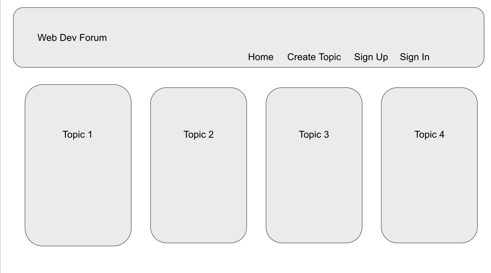
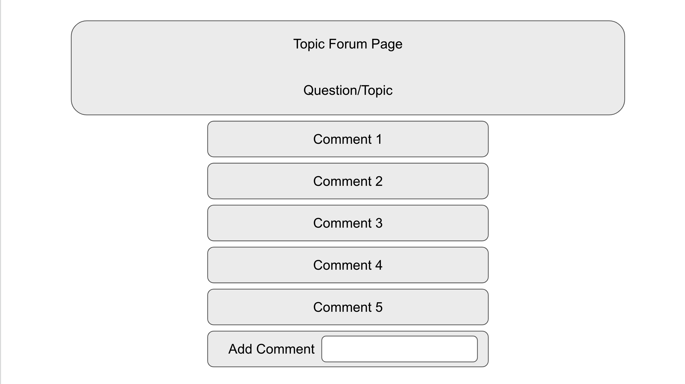
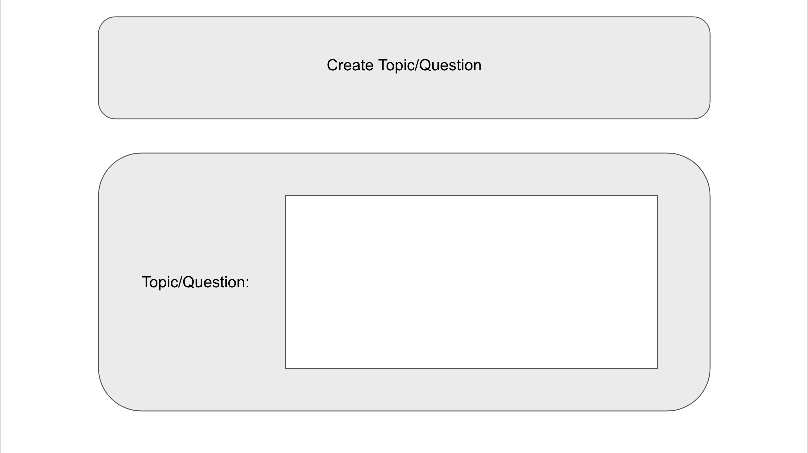

# Project-2-Forum_Page

## Requirements 
 
With your team, you’ll conceive and execute a design that solves a real-world problem. In creating your first collaborative full-stack application, you’ll combine a robust back end—with servers, databases, advanced APIs, and user authentication—to an intuitive front end. You’ll continue to build on the agile development methodologies you’ve used throughout this course, like storing your project code in GitHub, managing your work with a project management tool, and implementing feature and bug fixes using the Git branch workflow and pull requests.

Instead of using the front end you developed for your first project, you should start from scratch. Doing so will help you reinforce your existing front-end abilities and solidify your understanding of the dynamic between the front end and back end. Also, you’ve likely improved your skills since that first project, so with a stronger foundation now you can build a better application, using all of the additional practice you’ve had in the last several weeks.

You and your group will use everything you’ve learned over the past six weeks to create a full-stack application that works with real-world data to solve a real-world challenge. Even more than your first group project, this project will provide you with an opportunity to demonstrate your problem-solving skills, which employers will want to see when you begin to interview for development roles. Once again, the user story and acceptance criteria will depend on the project that you create, but your project must fulfill the following requirements:

-Use Node.js and Express.js to create a RESTful API.

-Use Handlebars.js as the template engine.

-Use MySQL and the Sequelize ORM for the database.

-Have both GET and POST routes for retrieving and adding new data.

-Use at least one new library, package, or technology that we haven’t discussed.

-Have a folder structure that meets the MVC paradigm.

-Include authentication (express-session and cookies).

-Protect API keys and sensitive information with environment variables.

-Be deployed using Heroku (with data).

-Have a polished UI.

-Be responsive.

-Be interactive (in other words, accept and respond to user input).

-Meet good-quality coding standards (file structure, naming conventions, follows best practices for class/id naming conventions, indentation, quality comments, and so on).

-Have a professional README (with unique name, description, technologies used, screenshot, and link to deployed application).

-----

## Presentation Requirments
 

Use this Project [Presentation Template](https://docs.google.com/presentation/d/10QaO9KH8HtUXj__81ve0SZcpO5DbMbqqQr4iPpbwKks/edit#slide=id.p) to address the following:

Elevator pitch: A one-minute description of your application.

Concept: What is your user story? What was your motivation for development?

Process: What were the technologies used? How were tasks and roles broken down and assigned? What challenges did you encounter? What were your successes?

Demo: Show your stuff!

Directions for future development.

Links to the deployed application and the GitHub repository. Use the [Guide to Deploy with Heroku and MySQL](https://coding-boot-camp.github.io/full-stack/heroku/deploy-with-heroku-and-mysql) on The Full-Stack Blog if you need a reminder on how to deploy to Heroku.

---
## User Story
 
As a user I WANT access to a forum where other developers ask question and discuss front and back end deveopment SO THAT I can get assistance with my projects and help others with theirs.

---
## Forum Basic Requirements
 

---
## Forum Wire Frames
  

 

 

 

---
## Forum Example/Screenshots
 

---
## Forum Demo Video
 

---
## Forum Functionality
  

- bcrypt password
- reply to comments
- upvote comments

---
## Forum Use Cases
 

---
## Link To Site And GitHub
 
---
